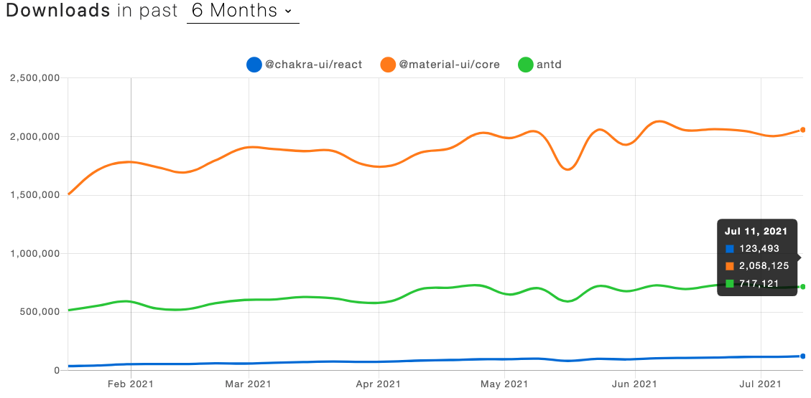

# components

리액트 컴포넌트는 여러 리액트 앱에서 함께 사용될 가능성이 있으므로, 독립적인 라이브러리에서 다루도록 취급합니다. (예를 들면, 메인 페이지와 동일한 view를 갖는 관리자 페이지) 따라서, 각 컴포넌트는 독립적으로 활용될 수 있도록 설계하여야 합니다.

'컴포넌트'의 단위는 UI 라이브러리에서 제공하는 것과 그 정의를 같이합니다.

## 설명

1. `page` 단위는 App에서 작성하고, 나머지 단위는 모두 components 라이브러리 내에 작성됩니다.
2. 상하 관계를 가지는 컴포넌트의 경우 하위 폴더를 생성하여 작업할 수 있으나, 되도록이면 각 컴포넌트를 세부적 단위로 쪼갠 채, `pages` 내에서 가져와 사용하도록 하기를 권장합니다.
3. react를 위한 컴포넌트가 이 라이브러리의 주를 이루며, react-native 컴포넌트는 `ExampleComponent.native.ts`와 같이 생성할 수 있습니다.
4. 작성한 컴포넌트는 모두 `components/src/index.ts` 에서 올바르게 export 해야합니다.
5. App 에서 사용할 때는 다음과 같이 불러와 사용합니다.

    ```tsx
    import { SomeComponent } from '@project-lc/components';

    function SomeComponent(): React.ReactElement {
        return (
            <SomeComponent />
        )
    }
    ```

6. 컴포넌트별로 [storybook](https://storybook.js.org/)을 작성하면 더욱 좋습니다.
7. UI 라이브러리에서 가져온 컴포넌트를 components 라이브러리에 굳이 재작성할 필요는 없습니다. 커스터마이징된 UI라이브러리 컴포넌트가 따로 필요한 경우에는 현재 라이브러리에 작성할 수 있습니다.

## 테스트

Run `nx test components` to execute the unit tests via [Jest](https://jestjs.io).

## 번외 - UI 라이브러리 비교

### Overview

1. **Chakra-Ui**

    커뮤니티에 의해 개발되고 있는 접근성과 재사용성, 유연성에 초점을 둔 리액트 UI 라이브러리입니다.

2. **Material-Ui**

    구글 Material Design 팀에서 제작하는 쉽고, 커스텀가능한 컴포넌트 라이브러리입니다.

3. **Ant-Design**

    중국의 AntDesign 개발팀에서 제작한 UI라이브러리로, 엔터프라이즈급 애플리케이션을 위한 컴포넌트 라이브러리입니다.

### 비교

(21.07.21 기준)

#### 정량적 비교

|                | Chakra | Material  | Antd      |
| -------------- | ------ | --------- | --------- |
| Github Stars   | 19.4k  | 69.8k     | **73.3k** |
| Contributors   | 408    | **2,235** | 1,443     |
| Used By        | 18.4k  | **624k**  | 221k      |
| Latest version | 1.6.4  | 4.12.2    | 4.16.8    |
| Since          | 2019~  | 2014~     | 2015~     |
| Components     | 중     | 다        | 다        |
| react-native   | △      | X         | O         |

#### Npm Trends 비교



#### 커스터마이징 및 스타일링 방식 비교

1. **Chakra**

    Chakra-ui의 가장 독특한 점은 대부분의 UI 컴포넌트에서 [Props로 모든 스타일을 다룰 수 있다는 점](https://chakra-ui.com/docs/features/style-props)입니다. 이는 매우 쉬운 사용성을 가지게 만들어 줍니다.

    ```tsx
    export default function Component() {
        return (
            <Flex
                display="flex"
                justify="center"
                align="center"
            >
                <Text
                    bgColor="teal"
                    color="white"
                    my={2} // margin-Y
                    p={1} // padding
                >
                   asdf
                </Text>
            </Box>
        )
    }
    ```

2. **Material**

    Material-UI 에서는 `makeStyles` 를 통해 useStyles hook을 생성할 수 있습니다. [material-ui styling](https://material-ui.com/styles/basics/)

    ```tsx
    const useStyles = makeStyles({
        root: {
            background: 'linear-gradient(45deg, #FE6B8B 30%, #FF8E53 90%)',
            border: 0,
            borderRadius: 3,
            boxShadow: '0 3px 5px 2px rgba(255, 105, 135, .3)',
            color: 'white',
            height: 48,
            padding: '0 30px',
        },
        });

    export default function Hook() {
        const classes = useStyles();
        return <Button className={classes.root}>Hook</Button>;
    }
    ```

3. **Antd**

    [less](https://lesscss.org/) 스타일시트언어를 사용하여 `className`으로 적용 또는 곧바로 `style` prop으로 적용합니다.

    css(less) 파일로 테마를 적용합니다. 따라서 테마 변경기능을 위해서는 webpack 같은 번들러 단에서의 설정이 필요. + `css-theme-switcher` 같은 외부 도구를 사용하여야 합니다.

#### responsive 디자인 비교

1. ChakraUI

    ```tsx
    export default function Asdf() {
        return (
            <Box w={{ base: 100, lg: 200, xl: 300 }}>
                <Avatar size={{ base: 'xs', lg: 'md' }} />
            </Box>
        )
    }
    ```

2. Material UI

    Grid의 경우 responsive prop 제공

    ```tsx
    const useStyles = makeStyles((theme) => ({
        root: {
            background: 'linear-gradient(45deg, #FE6B8B 30%, #FF8E53 90%)',
            border: 0,
            borderRadius: 3,
            boxShadow: '0 3px 5px 2px rgba(255, 105, 135, .3)',
            color: 'white',
            height: 48,
            padding: '0 30px',
            [theme.breakpoints.down('xs')]: {
                padding: '0 4px',
                boxShadow: theme.shadows[1],
            }
        },
    }));

    export default function Hook() {
        const classes = useStyles();
        return (
            <Grid container>
                <Grid item xs={12} lg={6}>
                    <Button className={classes.root}>Hook</Button>
                </Grid>
            </Grid>
        );
    }
    ```

3. Antd

    Grid 컴포넌트 (Row, Col)와 같이 레이아웃과 관련된 컴포넌트의 경우 Chakra-ui와 비슷한 방식으로 제공.

    ```tsx
    import { Row, Col } from 'antd';

    export default funciton Asdf() {
        return (
            <Row gutter={{ xs: 8, sm: 16, md: 24, lg: 32 }}>
                <Col className="gutter-row" span={6}>
                    <div style={style}>col-6</div>
                </Col>
                <Col className="gutter-row" span={6}>
                    <div style={style}>col-6</div>
                </Col>
                <Col className="gutter-row" span={6}>
                    <div style={style}>col-6</div>
                </Col>
                <Col className="gutter-row" span={6}>
                    <div style={style}>col-6</div>
                </Col>
            </Row>
        )
    }
    ```

#### dan의 평가

**ChakraUI**  

1. 컴포넌트의 수가 다른 두 라이브러리에 비해 적습니다. DatePicker, Table등 의 컴포넌트가 없습니다. 따라서, 자체적으로 만들어 사용하거나, 타 컴포넌트를 사용할 수 밖에 없습니다. (material-ui의 data-grid 는 따로 모듈식으로 배포되어 이 컴포넌트만 가져와 사용할 수 있기는 합니다.)
2. 스타일링이 매우x10 편합니다.
3. [chakra Factory](https://chakra-ui.com/docs/features/chakra-factory) 라고, html 태그 또는 다른 컴포넌트를 chakra 스럽게 스타일링할 수 있도록 만들어주는 기능을 제공합니다.
4. 비교적 레퍼런스가 적어, 궁금한 점 등을 검색해도 안나올 때가 있습니다.
5. UI 상태 관련 몇가지 훅 제공 (use클립보드, use모달상태, media-query 등)

**MaterialUI**  

1. 다른 라이브러리들에 비해 와일트루 개발자의 친화성이 더 높다.
2. 컴포넌트 수가 많고, 있어야 할건 다 있고 없을건 없습니다. like 화개장터 (AutoComplete 등)
3. 스타일링이 그렇게 편하지는 않지만, 다양한 방식 (withStyles HOC, makeStyles hook, 등)으로 스타일링 및 커스터마이징 할 수 있습니다.
4. 레퍼런스 많습니다.
5. `<Box />` 를 잘/많이 활용하면 ChakraUI와 비슷한 간편한 스타일링 방식을 누릴수 있습니다.
6. 이유는 알아보지 않았으나, nextjs에서 dev환경에서 사용할 때, 종종 스타일이 깨질 때가 있습니다.

**Antd**

1. 컴포넌트 수가 많고 있을건 다 있습니다.
2. 비교적 개발자 접근성이 낮습니다. 당연히 안써봤으니 친화성도 낮습니다.
3. 컴포넌트들이 다른 두 라이브러리에 비해 좀 더 동양적(?)입니다. 동아시아 문화권에 적합한 느낌
4. 레퍼런스가 그렇게 많지는 않고, docs가 철학 및 패러다임 이해에 조금 어려웠습니다. 컴포넌트 문서는 아주 깔끔합니다.
5. 스타일링 방식이 일관화되어있는 것 같지는 않다고 느꼈습니다.
6. 중국산이라 뭔가 미심쩍습니다.
